# Assignment Submission Guide

## Table of Contents
- [Introduction](#introduction)
- [Setting Up](#setting-up)
- [Submitting Assignments](#submitting-assignments)
  - [Creating a Branch for the Assignment](#creating-a-branch-for-the-assignment)
  - [Cloning the Repo and Setting Up in VS Code](#cloning-the-repo-and-setting-up-in-vs-code)
    - [Cloning the Repository Using GitHub](#cloning-the-repository-using-github)
    - [Reopening the Repository in VS Code](#reopening-the-repository-in-vs-code)
    - [Setting Up the Conda Environment](#setting-up-the-conda-environment)
  - [Completing and Submitting Your Assignment](#completing-and-submitting-your-assignment)
  - [Creating a Pull Request (PR)](#creating-a-pull-request-pr)
    - [PR Description](#pr-description)
    - [Public Repository](#public-repository)
    - [Pull Request Link](#pull-request-link)
    - [Do Not Tag Your Teaching Team](#do-not-tag-your-teaching-team)
    - [Do Not Merge Without Approval](#do-not-merge-without-approval)
- [Guidelines for Pull Request Descriptions](#guidelines-for-pull-request-descriptions)
- [Example Pull Request Submission Link](#example-pull-request-submission-link)
- [Troubleshooting Common Issues](#troubleshooting-common-issues)
  - [Handling Accidental Merges](#handling-accidental-merges)
  - [Fixing Merge Conflicts](#fixing-merge-conflicts)
  - [Undoing Commits](#undoing-commits)
  - [Restoring Deleted Files](#restoring-deleted-files)
  - [Reverting Changes](#reverting-changes)
  - [How to Resubmit](#how-to-resubmit)
  - [Syncing Your Forked Repository with the Original Repository](#syncing-your-forked-repository-with-the-original-repository)
  - [Need Further Help?](#need-further-help)
- [Conclusion](#conclusion)
- [Resources](#resources)

## Introduction

This guide is designed to standardize the submission and evaluation process for the learning modules in the DSI certificates. Our aim is to streamline the process using GitHub, ensuring consistency across modules. Submissions will primarily be in Python, SQL, or Markdown formats, with rare exceptions based on specific module requirements. 

## Setting Up

1. **Forking the Module Repository:** At the beginning of the module, participants will have to fork the module repository to their GitHub account. This is your personal workspace for the duration of the course.
    - Visit the designated UofT-DSI module repo.
    - Click "fork" on the page:
        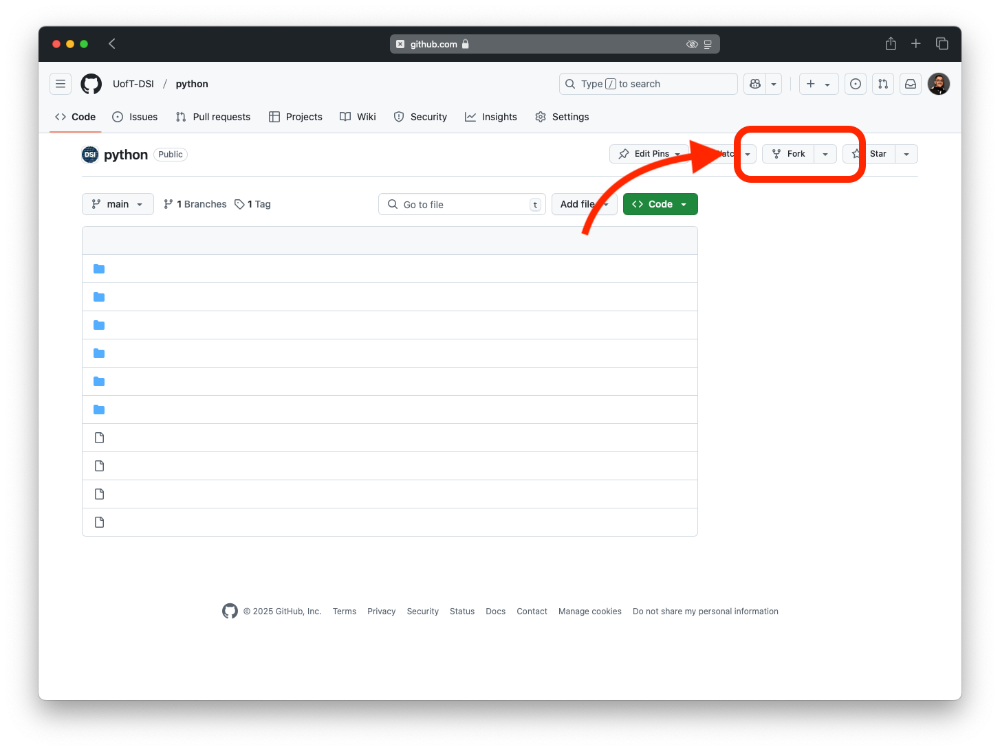
    - Please do **NOT** change the repo name presented in the "Create a new fork" page, simply click "Create Fork".
        
    - After a successful forking, your repo should be created at an address resembling `https://github.com/<YOUR GITHUB ID>/<LEARNING MODULE>`

*Note: For a visual guide on how to fork your repo, we've also created a video tutorial, ["How to Fork a Repo"](https://youtu.be/H-8kzcQWJ7U), available for you to watch.*

## Submitting Assignments

### Creating a Branch for the Assignment
For each assignment, you must create a new branch named after the assignment (refer to your assignment's "submission information" section). Note that we will be using [snake_case](https://en.wikipedia.org/wiki/Snake_case) for branch names. 

🚨 This branch should stem from **your** fork of the main module repository. 🚨

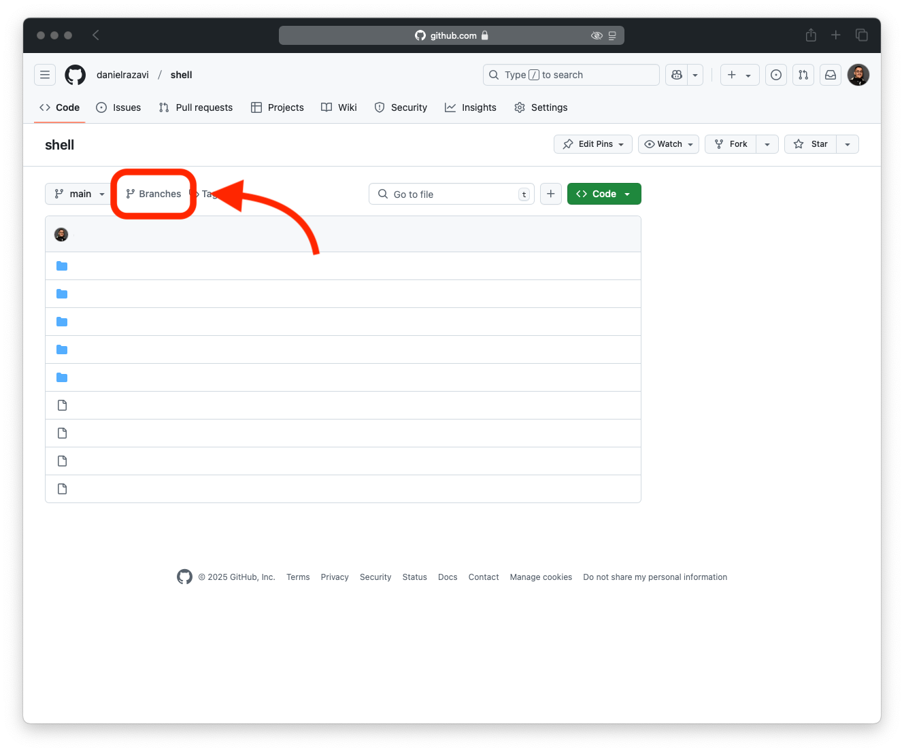


Make sure you name the branch appropriately as instructed in **the submission information** section of your assignment.
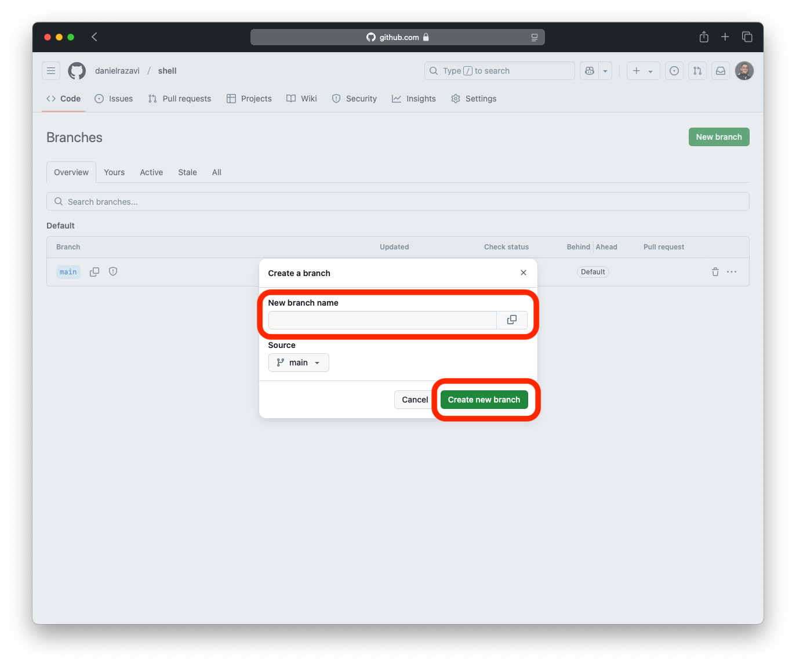

### Cloning the Repo and Setting Up in VS Code

#### Cloning the Repository Using GitHub
After creating your assignment branch, the next step is to clone the repository to your local machine. First, go to your forked repository on GitHub and click on the green "Code" button, then copy the HTTPS URL.

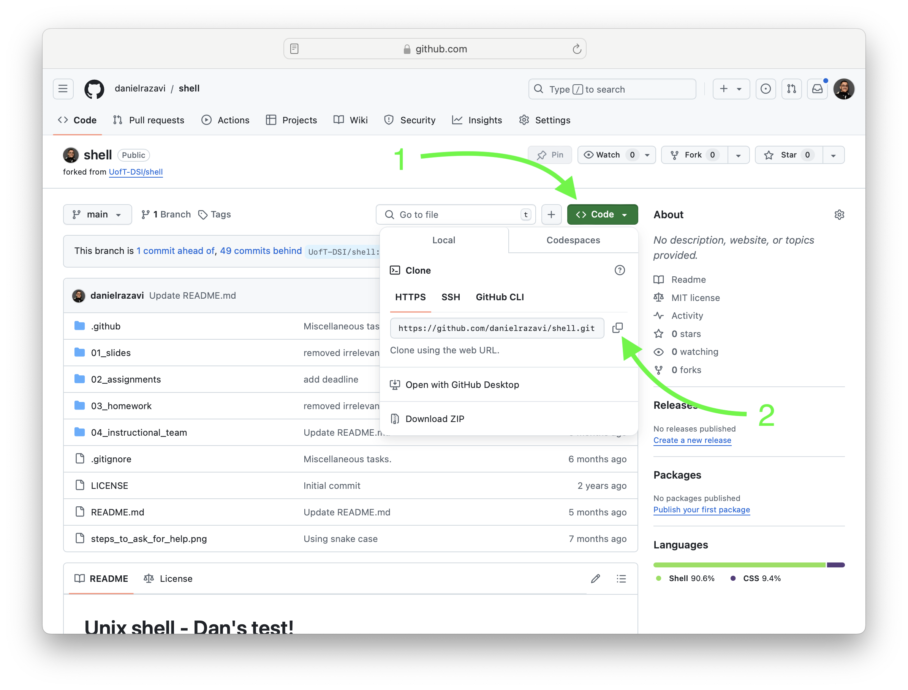

Open **VS Code** and go to the **Source Control** view by clicking the **Source Control** icon on the left-hand panel. Click the **Clone Repository** button. Paste the HTTPS URL you copied from GitHub into the prompt.

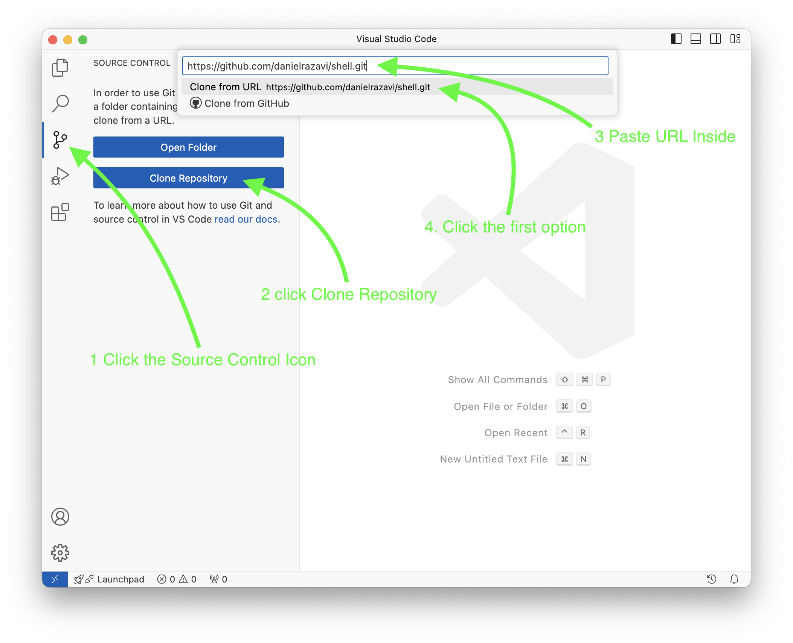

After you click on the **Clone from URL** button in VS Code, a file picker window will open, allowing you to choose where to save the repository files on your computer. This is where you decide where the project will be stored. 

Think of this like choosing a folder where you'll keep all your project work. It’s best to pick a place where you normally save school or project files, such as a folder named `Projects` or `Assignments`.

If you’re unsure where to put it, choose a folder where you normally store your projects or important documents. If you prefer, you can create a new folder, such as `Projects` or `Assignments`, to keep things organized.

Once you choose the folder, the repository will be copied (or "cloned") into that location so you can start working on it.

> *Note: "Repository" is just a folder that contains all the project files.*

VS Code will then clone the repository and open it in the workspace automatically.


#### Reopening the Repository in VS Code
If you close VS Code or need to reopen the repository later, the main way to reopen it is by clicking on the **Source Control** button in the left-hand panel and selecting **Open Folder** from the prompt that appears.

Alternatively, you can also reopen the repository by clicking on **File > Open Folder** in the top menu. Navigate to the location where the repository was cloned, select it, and click **Open** to continue working on your project.

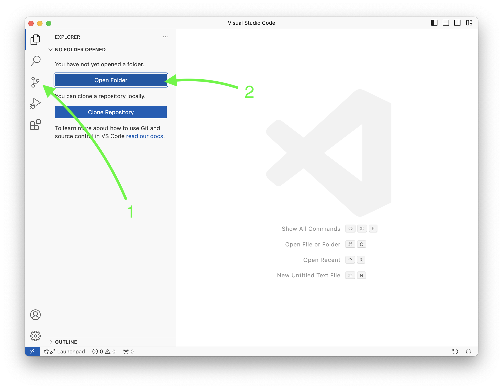

#### Setting Up the Conda Environment
You will need to use a Conda environment called `dsi_participant`. Ensure that this environment is activated in VS Code. If you have not set it up yet, follow the instructions provided in the [environment setup guide](https://github.com/UofT-DSI/onboarding/tree/main/environment_setup) (Specific to [Windows](https://github.com/UofT-DSI/onboarding/blob/main/environment_setup/tech_onboarding_windows.md#necessary-packages), [MacOS](https://github.com/UofT-DSI/onboarding/blob/main/environment_setup/tech_onboarding_mac.md#necessary-packages), and [Linux](https://github.com/UofT-DSI/onboarding/blob/main/environment_setup/tech_onboarding_linux.md#necessary-packages)) to install and activate the `dsi_participant` environment.

To ensure that you are working within the correct environment in VS Code:
- Open the terminal by clicking **Terminal > New Terminal**.
- Run the following command to activate the environment:

```
conda activate dsi_participant
```

After activating the environment, you are ready to begin working on your assignment.

### Completing and Submitting Your Assignment
Work on your assignment within the newly created branch. Ensure that all changes are **committed and pushed to the branch** and **🚨NOT THE MAIN BRANCH🚨**. Make sure your submission includes all required files, following the formats specified.

Once you've completed your work, it's time to submit your changes by committing and pushing to your assignment branch. Make sure you're following proper Git workflow as outlined in the Git basics slides: [Git Basics](https://github.com/UofT-DSI/git/blob/main/01_materials/slides/03_git_basics.pdf).

When you're ready to submit, open a pull request (PR) from your assignment branch to **your fork's main branch**. For more guidance, see the section [Creating a Pull Request (PR)](#creating-a-pull-request-pr).

### Creating a Pull Request (PR)
*Upon completing your assignment*, create a pull request from your assignment branch to **your fork's main branch**. (Please make sure the pull request is **NOT** to the source/upstream repository's main branch)


#### PR Description
Your pull request must include a detailed description of what you aimed to accomplish, the approach taken, and whether it has been tested. Please read [Guidelines for Pull Request Descriptions](#guidelines-for-pull-request-descriptions).

#### Public Repository
Ensure that your repository is public and accessible to others. If your repository is private, technical facilitators and learning support staff will not be able to access it and therefore will not be able to evaluate your submissions. To do this, go to your repository and check for the "public" badge next to the repository name.

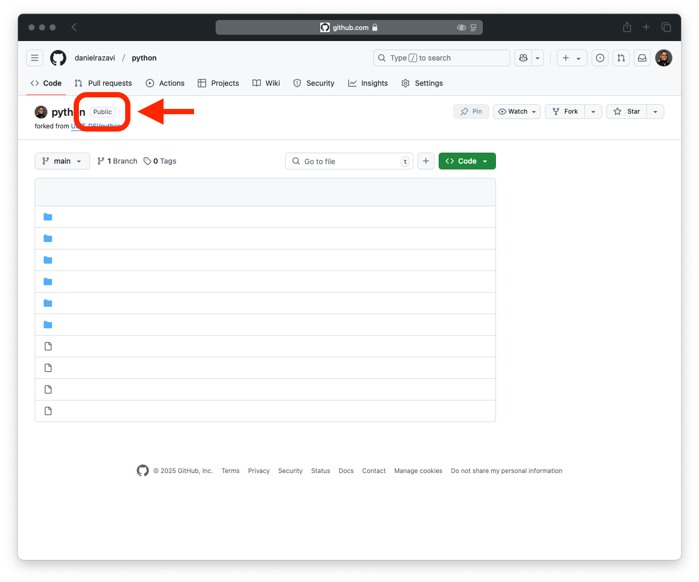

#### Pull Request Link
Please visit your pull request on another browser or in your browser’s private mode to ensure that it is accessible by everyone. [Example Pull Request Submission Link](#example-pull-request-submission-link).

#### Do Not Tag Your Teaching Team
Do not tag your teaching team in the pull request. We will be able to find your submissions if you have followed the instructions above!

#### Do Not Merge Without Approval
Do not merge your pull request unless it has been explicitly approved by the Learning Support team. If there are comments or feedback, please fix them, recommit your changes, and wait for Learning Support to review again. 🚨 Only after Learning Support has approved should you merge the pull request.🚨

## Guidelines for Pull Request Descriptions

Your pull request needs to include the following:
- Summarize your implemented solution and any challenges faced.
- Detail the testing methods applied.
- Highlight any specific areas you'd like feedback on.

Please use the following template for your pull request descriptions:

    TITLE: UofT-DSI | <Module Name> - Assignment <assignment number>
   
    ## What changes are you trying to make? (e.g. Adding or removing code, refactoring existing code, adding reports)

    ## What did you learn from the changes you have made?

    ## Was there another approach you were thinking about making? If so, what approach(es) were you thinking of?

    ## Were there any challenges? If so, what issue(s) did you face? How did you overcome it?

    ## How were these changes tested?

    ## A reference to a related issue in your repository (if applicable)

    ## Checklist
    - [ ] I can confirm that my changes are working as intended

Here’s an example of how your pull request should look once submitted:


    TITLE: UofT-DSI | Shell - Assignment 2

    ## What changes are you trying to make?
    I have added shell scripts to automate file processing and created a script to move files based on their extensions. I also added comments to explain the logic behind each script.

    ## What did you learn from the changes you have made?
    I learned how to use loops, conditionals, and arguments in shell scripts to automate tasks and manage files.

    ## Was there another approach you were thinking about making?
    I considered using Python for file processing but stuck with shell scripting as per the assignment requirements.

    ## Were there any challenges?
    I faced challenges when handling edge cases like files with no extensions or hidden files. I resolved these issues by adding checks within the script.

    ## How were these changes tested?
    I tested the scripts on a sample directory with various file types and used different test cases to ensure the scripts handled all edge cases properly.

    ## Checklist
    - [x] I can confirm that my changes are working as intended
    - [x] I have tested the script with different file types, and it works as expected

- For the most up-to-date template, please reference [pull_request_template.md](https://github.com/UofT-DSI/.github/blob/main/pull_request_template.md?plain=1)

## Example Pull Request Submission Link
A pull request link is typical comprised of the following structure: `https://github.com/<github_username>/<repo_name>/pull/<pr_id>`

For example:
    ```
    https://github.com/johnsmith/python/pull/2
    ```

*Note: For a visual guide on how to submit your assignments, we've also created a video tutorial, ["How to Submit an Assignment"](https://youtu.be/gXtxb0ECs2A), available for you to watch.*

## Syncing Your Forked Repository with the Original Repository

Over time, the original repository might receive updates or changes from the course facilitators. To ensure you have the latest features, bug fixes, or updates, you should periodically sync your forked repository with the original. This helps avoid issues like working with outdated materials or missing important changes that could affect your assignments.

### Steps to Sync Your Fork:

**Navigate to Your Forked Repository:**
- Go to your forked repository on GitHub. You can find it at an address like `https://github.com/<YOUR GITHUB ID>/<LEARNING MODULE>`.
   
**Click the "Sync Fork" Button:**
- At the top of the page, you will see a "Sync fork" button. Click this button to pull in any new changes from the original (upstream) repository.

**Update Your Branch:**
- After clicking the "Sync fork" button, you will see a green "Update branch" button if there are any new updates from the original repository. Click this button to merge those changes into your fork.

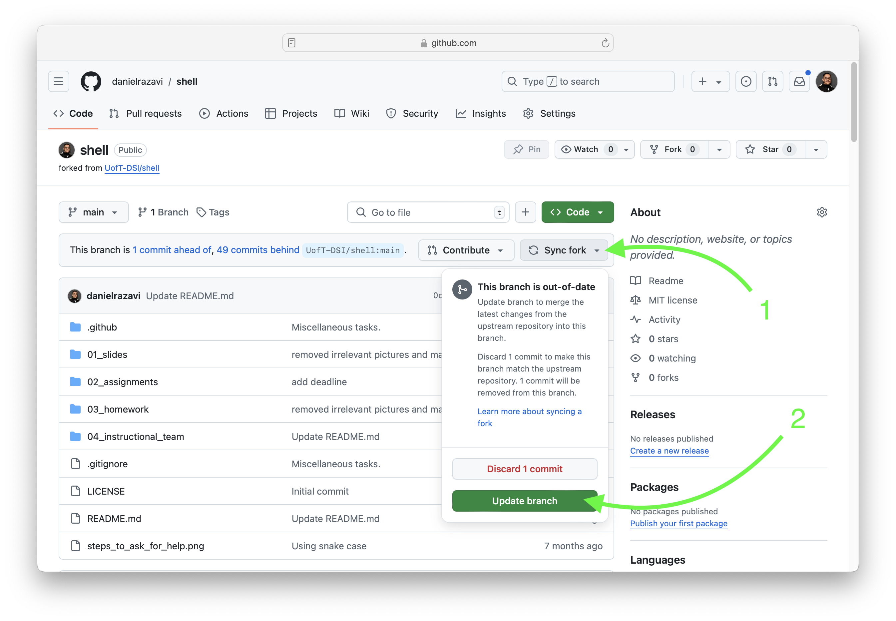

**Confirm Sync:**
- Once the update is complete, your forked repository will be up to date with the original. If you attempt to click the "Sync fork" button again, it will notify you that "This branch is not behind the upstream," meaning no new changes are available to sync.

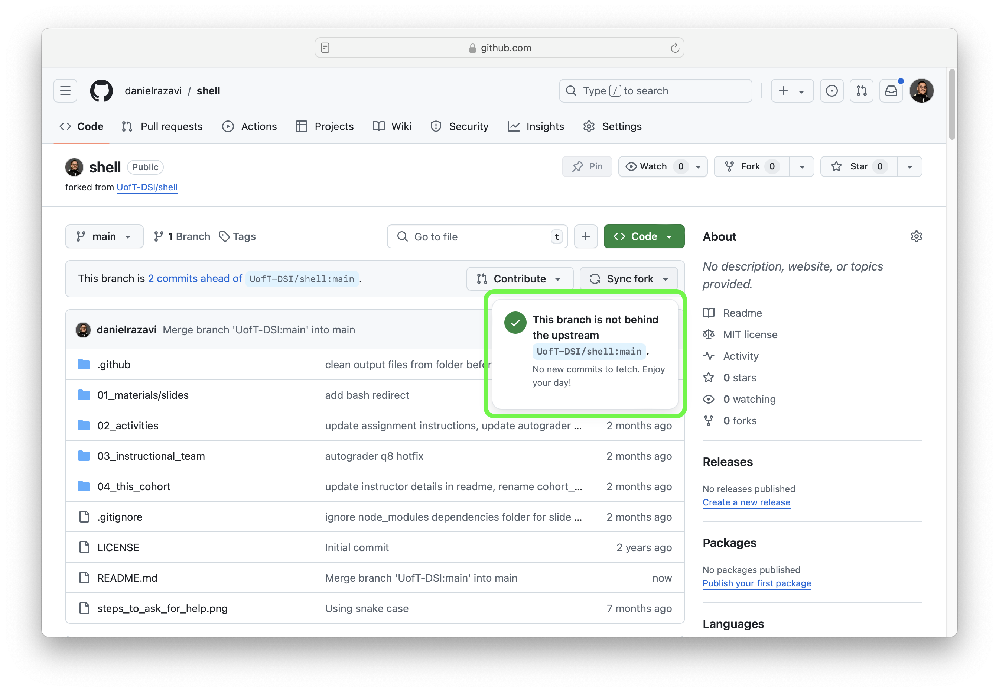

> **Note: Handling Conflicts When Syncing**
>
> If you've already worked on files (like your homework or assignments) in your fork and the same files have been changed in the upstream repository, GitHub will detect a conflict.
>
> GitHub will show a "Resolve conflict" button and may prompt you to create a pull request to handle the conflict. This allows you to decide which changes to keep — your own, the new updates, or a mix of both — without losing your work.
>
> Be sure to carefully review the changes so you don’t accidentally overwrite your completed work. After resolving, you can commit the changes and sync your fork with the latest updates.

## Troubleshooting Common Issues

### How to Resubmit

If you got a "request changes" or "approval" on your PR and for whatever reason you want to change something in your PR (as this is a very common and normal thing), you need to:

1. Make the necessary changes in your local repository.
2. Stage the changes:
   ```git add <file-path>```
3. Commit the changes with a descriptive message:
   ```git commit -m "Update <file-path> with additional changes"```
4. Push the changes to the same branch on your remote repository:
   ```git push origin <branch-name>```
5. The new commit will automatically update the existing PR with the latest changes.

### Fixing Merge Conflicts
Merge conflicts occur when changes from different branches conflict with each other. To resolve merge conflicts:

1. Identify the conflicting files using `git status`. Git will list the files with conflicts under the "Unmerged paths" section. Example output:
    ```
    On branch your-branch You have unmerged paths. (fix conflicts and run "git commit")
    
    Unmerged paths: (use "git add <file>..." to mark resolution) both modified: file1.txt both modified: file2.txt
    ```
2. Open the conflicting files in your code editor. Look for conflict markers (`<<<<<<<`, `=======`, `>>>>>>>`).
3. Decide which changes to keep and remove the conflict markers by simply deleting them using your keyboard.
4. After resolving the conflicts, stage the resolved files:
    ```git add <resolved-file>```
5. Commit the merge:
    ```git commit```


### Undoing Commits
To undo a commit, you can use `git reset` or `git revert`:

- To undo the last commit but keep the changes:
  ``git reset --soft HEAD~1``
- To undo the last commit and discard the changes:
  ``git reset --hard HEAD~1``
- To create a new commit that undoes the changes:
  ``git revert <commit-hash>``

You can get the commit hash from `git log`.

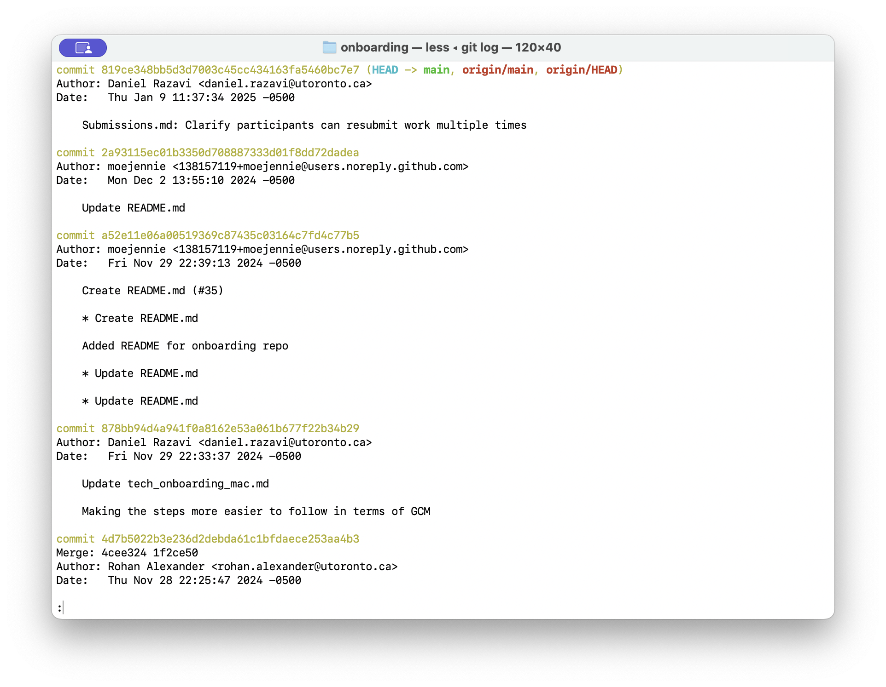

### Restoring Deleted Files
If you accidentally deleted a file and want to restore it:

1. Find the commit where the file was deleted:
   ```git log --diff-filter=D --summary```
2. Restore the file from the commit:
   ```git checkout <commit-hash>^ -- <file-path>```
3. Stage and commit the restored file:
   ```git add <file-path>```
   ```git commit -m "Restore deleted file"```

### Reverting Changes
To revert changes in a file to a previous commit:

1. Identify the commit hash of the desired state:
   ```git log```
2. Revert the file to the specific commit:
   ```git checkout <commit-hash> -- <file-path>```
3. Stage and commit the reverted file:
   ```git add <file-path>```
   ```git commit -m "Revert changes in <file-path> to <commit-hash>"```

## Handling Accidental Merges

Sometimes, you might accidentally merge your assignment branch into your fork's main branch before it's time to do so. If this happens, it's important to know how to reverse the changes to maintain the integrity of your main branch. Follow these steps to undo an accidental merge:

### Steps to Revert a Merge

1. **Identify the Merge Commit:**
    - Go to your repository's pull requests.
        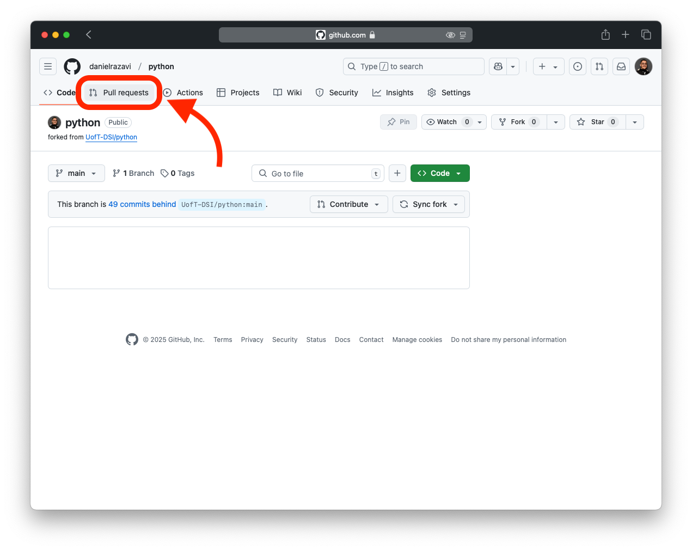
    - Click on "closed" to view a list of closed pull requests.
        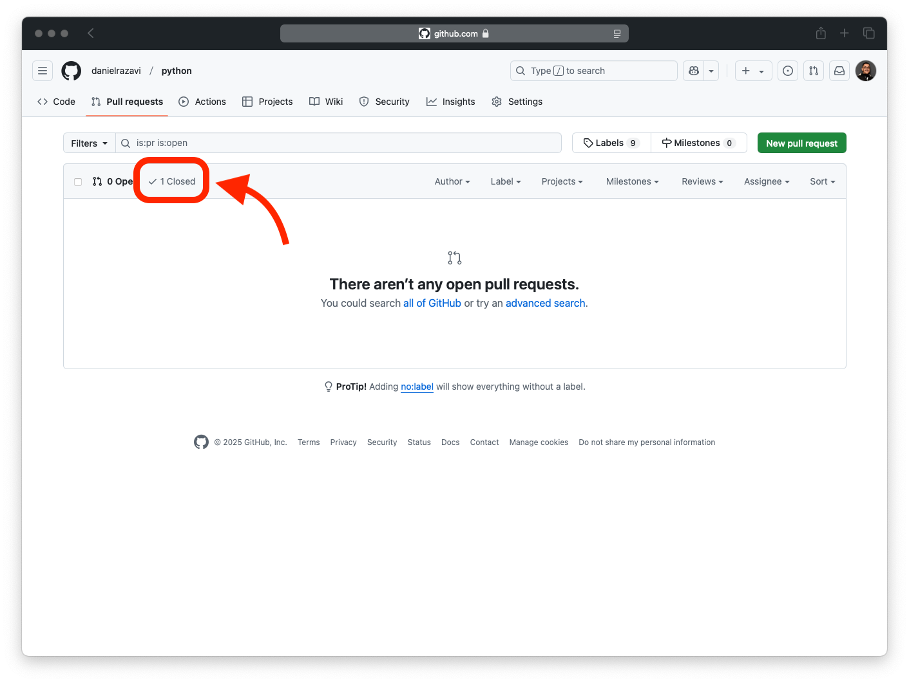
    - Find the pull request where the merge occurred.
        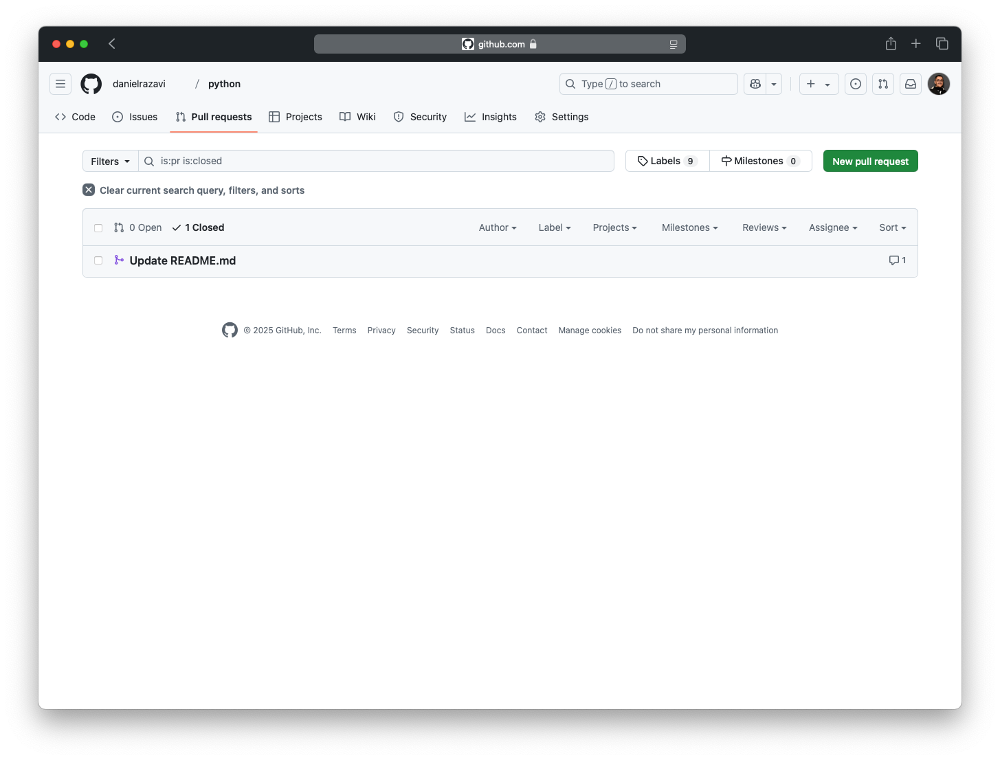
    - Click on the pull request to open its details.
2. **Revert the Merge Commit:**
    - Click on the "Revert" button. This will create a new commit that undoes the changes made by the merge.
        
    - Follow the prompts to create a new pull request for the revert commit. Ensure this pull request is against your fork's main branch.
        

3. **Review and Merge the Revert Pull Request:**
    - Carefully review the changes in the revert pull request to ensure it only undoes the merge.
    - Once confirmed, merge the revert pull request into your main branch. This will restore your main branch to its state before the accidental merge.

4. **Clean Up Your Branches:**
    - If necessary, recreate the assignment branch from the main branch to continue working on your assignment.
    - Ensure any new changes are committed to the correct branch.

## Need Further Help?

If you encounter difficulties or need clarification on the steps, don't hesitate to reach out to the technical facilitators or learning support staff. They are here to help you navigate any issues you might encounter during your coursework.

## Conclusion
Participants may resubmit assignments by making additional Git commits to the same branch from which the pull request originates. The pull request will automatically update with the latest changes, allowing revisions both before and after feedback. This ensures a smooth and efficient process for continuous improvement.

## Resources

* [How to Fork a Repo](https://youtu.be/H-8kzcQWJ7U)
* [How to Submit an Assignment](https://www.youtube.com/watch?v=03nLtHn11c0)
